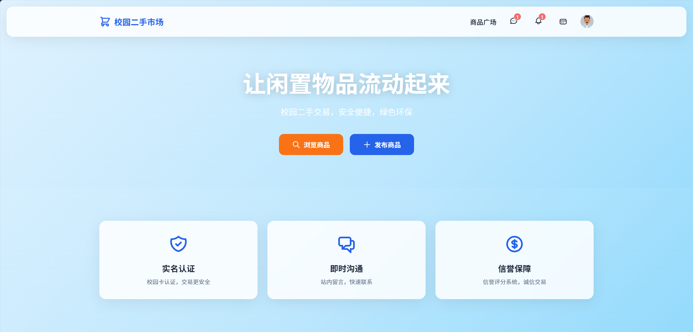
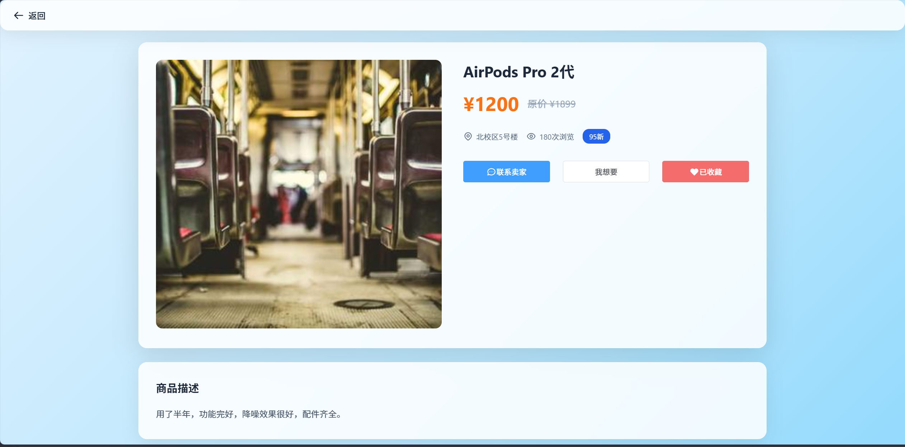
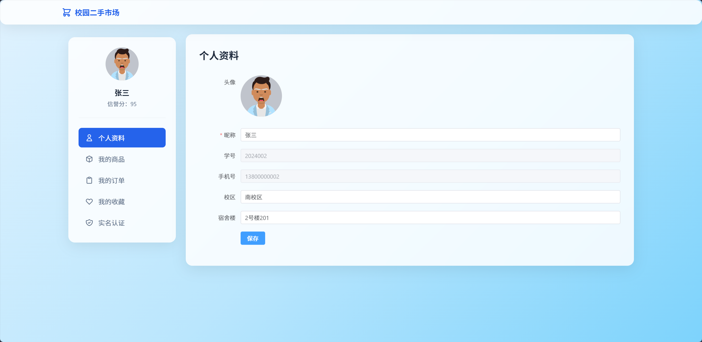
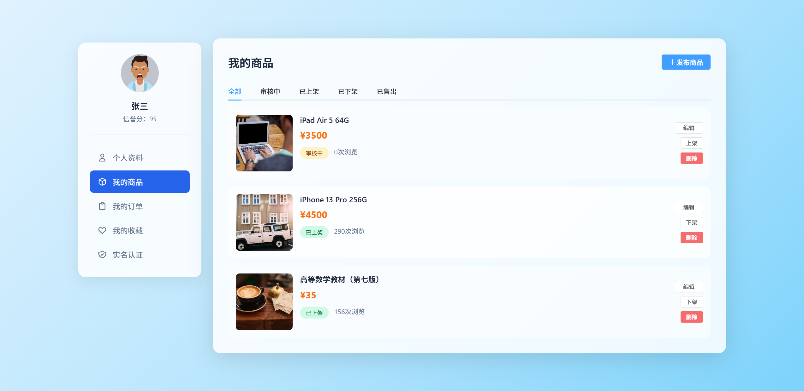
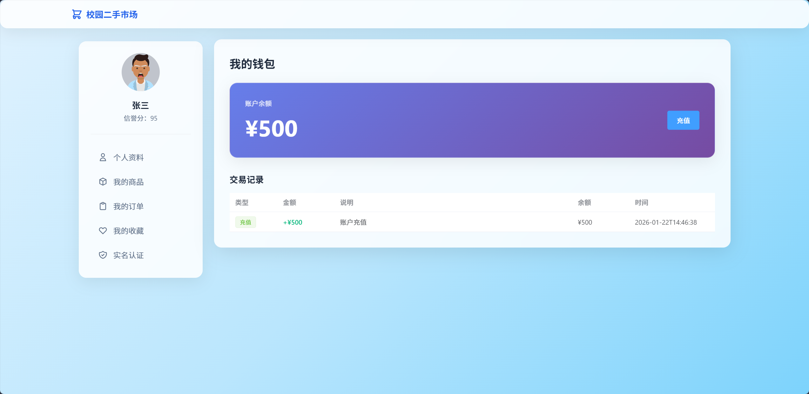
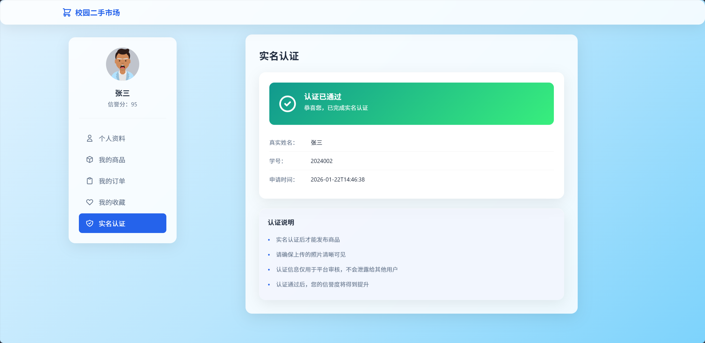
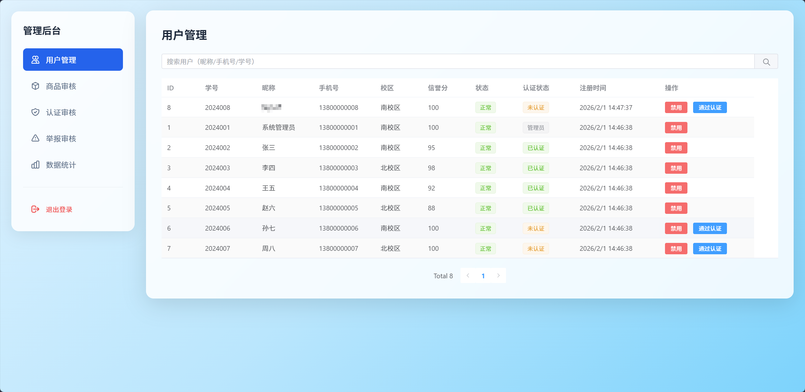
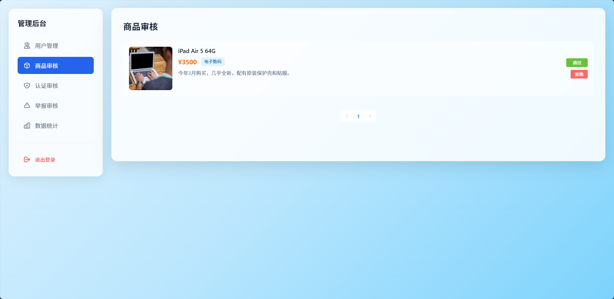
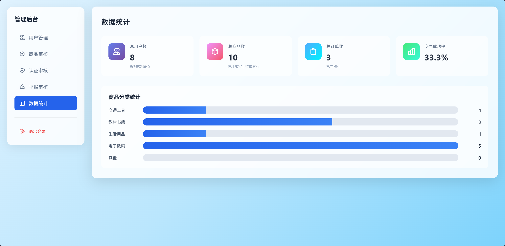

# 校园二手交易平台

一个基于 Spring Boot + Vue 3 的校园二手商品交易系统，为大学生提供安全、便捷的二手物品交易平台。

## 📋 项目简介

校园二手交易平台是一个专为大学生设计的二手商品交易系统，支持商品发布、在线交易、即时聊天、钱包支付等功能。系统采用前后端分离架构，提供完善的用户认证、商品审核、信用评分等机制，确保交易安全可靠。

## ✨ 核心功能

### 用户功能
- **用户注册/登录**：手机号注册，JWT Token 认证
- **个人中心**：信息管理、头像上传、宿舍/校园设置
- **学生认证**：学号、身份证、学生证认证，提升信用度
- **信用评分**：基于交易行为的信用评分系统

### 商品功能
- **商品发布**：支持多图上传、分类、价格、成色、地点等信息
- **商品浏览**：分页查询、分类筛选、关键词搜索
- **商品详情**：图片展示、卖家信息、留言咨询
- **商品管理**：编辑、下架、删除我的商品
- **商品审核**：管理员审核机制，确保商品质量

### 交易功能
- **订单创建**：一键下单，生成唯一订单号
- **订单流程**：确认 → 支付 → 发货 → 确认收货
- **订单管理**：买家订单、卖家订单分离查看
- **订单取消**：支持订单取消和退款

### 钱包功能
- **余额管理**：充值、支付、退款、收入
- **交易记录**：完整的交易流水记录
- **支付密码**：支付时需验证密码，保障资金安全
- **余额对账**：记录每笔交易前后余额

### 聊天功能
- **即时通讯**：买卖双方实时聊天
- **会话管理**：聊天会话列表，关联商品信息
- **未读提醒**：未读消息计数和提醒
- **消息已读**：自动标记消息已读状态

### 收藏功能
- **商品收藏**：收藏感兴趣的商品
- **收藏管理**：查看和管理我的收藏

### 举报功能
- **用户举报**：举报违规用户或商品
- **证据上传**：支持上传举报证据图片
- **信用惩罚**：举报通过后扣除信用分

### 管理员功能
- **用户管理**：查看、禁用、认证用户
- **商品审核**：批准、驳回、下架商品
- **认证管理**：审核学生认证申请
- **举报处理**：处理用户举报，维护平台秩序
- **数据统计**：用户、商品、订单等数据统计

## 🛠️ 技术栈

### 后端技术
- **框架**：Spring Boot 2.7.14
- **ORM**：MyBatis Plus 3.5.3.1
- **数据库**：MySQL 8.0.33
- **缓存**：Redis
- **认证**：JWT (jjwt 0.11.5)
- **加密**：Spring Security BCrypt
- **工具库**：Hutool 5.8.20、Lombok

### 前端技术
- **框架**：Vue 3.3.4
- **构建工具**：Vite 4.4.9
- **路由**：Vue Router 4.2.4
- **状态管理**：Pinia 2.1.6
- **UI 组件**：Element Plus 2.3.14
- **HTTP 客户端**：Axios 1.5.0
- **样式**：Sass 1.66.1

## 📁 项目结构

```
campus-market/
├── back/                           # 后端项目
│   ├── src/main/java/com/campus/market/
│   │   ├── controller/            # 控制层
│   │   ├── service/               # 业务层接口
│   │   ├── service/impl/          # 业务层实现
│   │   ├── entity/                # 数据实体
│   │   ├── mapper/                # 数据访问层
│   │   ├── dto/                   # 数据传输对象
│   │   ├── vo/                    # 视图对象
│   │   ├── config/                # 配置类
│   │   ├── interceptor/           # 拦截器
│   │   ├── exception/             # 异常处理
│   │   ├── util/                  # 工具类
│   │   └── common/                # 通用类
│   ├── src/main/resources/
│   │   ├── application.yml        # 应用配置
│   │   └── mapper/                # MyBatis XML
│   └── pom.xml                    # Maven 配置
│
└── front/                          # 前端项目
    ├── src/
    │   ├── api/                   # API 接口
    │   ├── views/                 # 页面组件
    │   │   ├── admin/            # 管理员页面
    │   │   ├── chat/             # 聊天页面
    │   │   ├── goods/            # 商品页面
    │   │   └── user/             # 用户中心页面
    │   ├── router/                # 路由配置
    │   ├── stores/                # 状态管理
    │   ├── utils/                 # 工具函数
    │   ├── styles/                # 全局样式
    │   ├── App.vue
    │   └── main.js
    ├── package.json
    └── vite.config.js
```

## 🚀 快速开始

### 环境要求
- JDK 1.8+
- Maven 3.6+
- MySQL 8.0+
- Redis 5.0+
- Node.js 16+

### 后端启动

1. 创建数据库
```sql
CREATE DATABASE campus_market CHARACTER SET utf8mb4 COLLATE utf8mb4_unicode_ci;
```

2. 修改配置文件
编辑 `back/src/main/resources/application.yml`，配置数据库和 Redis 连接信息：
```yaml
spring:
  datasource:
    url: jdbc:mysql://localhost:3306/campus_market?useUnicode=true&characterEncoding=utf8&serverTimezone=Asia/Shanghai
    username: root
    password: your_password
  redis:
    host: localhost
    port: 6379
```

3. 导入数据库表结构
运行项目根目录下的 SQL 脚本（如果有）

4. 启动后端服务
```bash
cd back
mvn clean install
mvn spring-boot:run
```

后端服务将在 `http://localhost:8080` 启动

### 前端启动

1. 安装依赖
```bash
cd front
npm install
```

2. 启动开发服务器
```bash
npm run dev
```

前端服务将在 `http://localhost:5173` 启动

3. 构建生产版本
```bash
npm run build
```

## 📸 系统截图

### 首页


### 商品列表


### 商品详情


### 用户中心


### 我的商品


### 聊天界面


### 钱包管理


### 学生实名认证


### 管理员后台 - 用户管理


### 管理员后台 - 商品审核


### 管理员后台 - 数据统计


## 🔐 默认账号

系统初始化后，可以使用以下账号登录：

**管理员账号**
- 手机号：admin
- 密码：123456

**普通用户**
- 需要自行注册

## 📊 数据库设计

### 核心数据表
- `user` - 用户表
- `goods` - 商品表
- `orders` - 订单表
- `chat_session` - 聊天会话表
- `chat_message` - 聊天消息表
- `wallet_transaction` - 钱包交易表
- `favorite` - 收藏表
- `verification` - 认证表
- `report` - 举报表
- `notification` - 通知表
- `message` - 留言表

## 🔄 业务流程

### 商品交易流程
1. 卖家发布商品 → 待审核
2. 管理员审核 → 批准/驳回
3. 买家浏览商品 → 收藏/咨询
4. 买家创建订单 → 待确认
5. 卖家确认订单 → 待支付
6. 买家支付 → 待发货
7. 卖家发货 → 待收货
8. 买家确认收货 → 订单完成

### 钱包交易流程
1. 用户充值 → 余额增加
2. 买家支付 → 余额扣款（需密码验证）
3. 订单完成 → 卖家收款
4. 订单取消 → 买家退款

### 认证流程
1. 用户提交认证申请（学号、身份证、学生证）
2. 管理员审核
3. 认证通过 → 获得认证标签

## 🔧 配置说明

### JWT 配置
- 密钥：在 `application.yml` 中配置
- 过期时间：7 天（604800000 毫秒）

### 文件上传配置
- 单文件大小限制：10MB
- 总请求大小限制：50MB
- 上传路径：`./uploads/`

### CORS 配置
- 允许所有来源跨域访问
- 支持的方法：GET、POST、PUT、DELETE、OPTIONS

## 🛡️ 安全机制

- **密码加密**：使用 BCrypt 加密存储
- **JWT 认证**：Token 有效期 7 天
- **支付密码**：支付时需验证密码
- **权限控制**：基于角色的访问控制（用户/管理员）
- **信用评分**：违规行为扣除信用分
- **商品审核**：管理员审核机制

## 📝 API 文档

### 用户相关
- `POST /api/user/register` - 用户注册
- `POST /api/user/login` - 用户登录
- `GET /api/user/info` - 获取用户信息
- `PUT /api/user/update` - 更新用户信息

### 商品相关
- `POST /api/goods/publish` - 发布商品
- `GET /api/goods/list` - 商品列表
- `GET /api/goods/{id}` - 商品详情
- `PUT /api/goods/update` - 更新商品
- `DELETE /api/goods/{id}` - 删除商品

### 订单相关
- `POST /api/order/create` - 创建订单
- `GET /api/order/buyer` - 买家订单
- `GET /api/order/seller` - 卖家订单
- `PUT /api/order/confirm` - 确认订单
- `PUT /api/order/pay` - 支付订单
- `PUT /api/order/ship` - 发货
- `PUT /api/order/complete` - 确认收货

### 聊天相关
- `POST /api/chat/session` - 创建会话
- `GET /api/chat/sessions` - 会话列表
- `POST /api/chat/send` - 发送消息
- `GET /api/chat/messages/{sessionId}` - 消息列表

### 钱包相关
- `GET /api/wallet/balance` - 查询余额
- `POST /api/wallet/recharge` - 充值
- `POST /api/wallet/pay` - 支付
- `GET /api/wallet/transactions` - 交易记录

## 🤝 贡献指南

欢迎提交 Issue 和 Pull Request 来改进项目。

## 📄 开源协议

本项目采用 MIT 协议开源。

## 👥 联系方式

如有问题或建议，欢迎联系：
- Email: [2929026775@qq.com]
- GitHub: [[xwq-image/Diao-TradingMarket](https://github.com/xwq-image/Diao-TradingMarket)]


